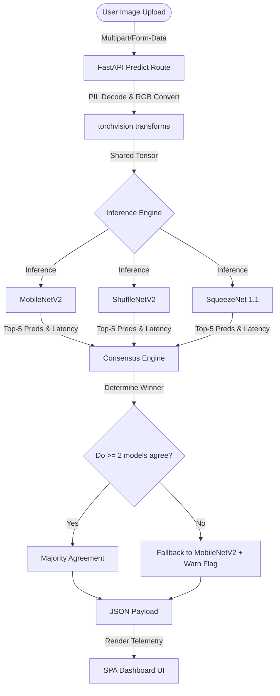
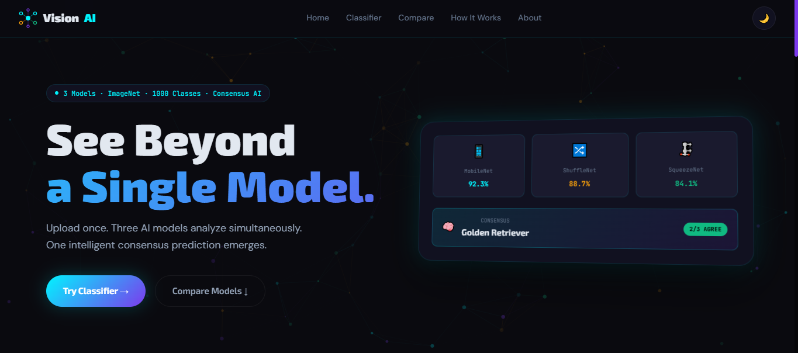

# VisionAI — Multi-Model Smart Image Classifier

VisionAI is a modern, high-performance web application that performs real-time image classification across three distinct lightweight convolutional neural networks: **MobileNetV2**, **ShuffleNetV2**, and **SqueezeNet 1.1**. Powered by a FastAPI backend and PyTorch, it evaluates model predictions in parallel and runs a custom consensus algorithm to determine the final label, displaying results on a stunning glassmorphic dashboard.

---

## 🚀 Key Features

*   **Multi-Model Parallel Inference:** Evaluates uploaded images against MobileNetV2, ShuffleNetV2, and SqueezeNet 1.1 simultaneously.
*   **Consensus Engine:** Resolves label predictions using a custom voting classifier:
    *   **Majority Agreement:** Reaches a consensus if $\ge$ 2 models agree on the Top-1 label.
    *   **Fallback Routing:** Defaults to MobileNetV2 (the highest-accuracy model) and flags the result if all three models disagree.
*   **Stunning Glassmorphic Dashboard:** A highly interactive SPA frontend featuring:
    *   System-wide light/dark mode support.
    *   Telemetry displaying exact model inference times in milliseconds.
    *   Staggered UI entry animations and live counter increments.
    *   Expandable Top-5 prediction accordions for detailed confidence breakdowns.
*   **Automatic Image Standardization:** Decodes formats (JPEG, PNG, WebP) on-the-fly and standardizes inputs via PyTorch torchvision transforms.

---

## 🛠️ Architecture



---

## ⚙️ Model Specifications

The application uses lightweight, production-grade models pre-trained on the ImageNet dataset:

| Model | Parameter Count | ImageNet Top-1 Accuracy | Model Size | Creator / Source |
| :--- | :--- | :--- | :--- | :--- |
| **MobileNetV2** | 3.4 Million | 71.88% | ~14.0 MB | Google |
| **ShuffleNetV2** | 2.3 Million | 69.40% | ~9.2 MB | Face++ |
| **SqueezeNet 1.1** | 1.2 Million | 58.20% | ~4.9 MB | DeepScale |

---

## 📦 Installation & Setup

Follow these steps to run VisionAI locally on your system:

### 1. Prerequisites
Ensure you have **Python 3.8+** installed.

### 2. Clone and Setup Environment
Navigate to the project root and create a virtual environment:

```powershell
# Create virtual environment
python -m venv .venv

# Activate virtual environment
.venv\Scripts\activate
```

### 3. Install Dependencies
Install the required packages using pip:

```powershell
pip install -r requirements.txt
```

> [!NOTE]
> Dependencies include `fastapi`, `uvicorn`, `torch`, `torchvision`, `pillow`, `python-multipart`, and `numpy`.

### 4. Run the Backend Server
Start the Uvicorn development server:

```powershell
uvicorn app:app --reload
```

The application will start, download the ImageNet label file (`imagenet_labels.json`), load the model weights, and listen on:
*   Frontend Dashboard & API Docs: **`http://127.0.0.1:8000`**

### 💡 Troubleshooting: `TypeError` on Startup

If you encounter this traceback when starting the application:
```text
TypeError: Router.__init__() got an unexpected keyword argument 'on_startup'
```
This is caused by a version mismatch between `fastapi` and its dependency `starlette` in your **global/system-wide** Python installation.

**How to resolve:**
Make sure you are running the application from within the project's local virtual environment (`.venv`), where the correct and compatible package versions are installed:

*   **Option A: Run using the virtual environment interpreter directly:**
    ```powershell
    .venv\Scripts\python.exe -m uvicorn app:app --reload
    ```
*   **Option B: Activate the virtual environment before running:**
    *   **PowerShell:**
        ```powershell
        .venv\Scripts\Activate.ps1
        uvicorn app:app --reload
        ```
    *   **Command Prompt:**
        ```cmd
        .venv\Scripts\activate.bat
        uvicorn app:app --reload
        ```

---


## 📡 API Endpoints

### Serve SPA Dashboard
*   **Endpoint:** `GET /`
*   **Description:** Serves the interactive dashboard.

### Analyze Image
*   **Endpoint:** `POST /predict`
*   **Request Type:** `multipart/form-data`
*   **Parameters:** `file` (Image file in JPEG, PNG, or WebP format)
*   **Response Sample:**
    ```json
    {
      "mobilenet": {
        "top1_label": "Golden Retriever",
        "top1_score": 88.42,
        "top5": [
          { "label": "Golden Retriever", "score": 88.42 },
          { "label": "Labrador Retriever", "score": 6.18 },
          { "label": "Red Bone Coonhound", "score": 1.25 }
        ],
        "inference_time_ms": 32.14
      },
      "shufflenet": {
        "top1_label": "Golden Retriever",
        "top1_score": 79.11,
        "top5": [ ... ],
        "inference_time_ms": 18.91
      },
      "squeezenet": { ... },
      "consensus": {
        "consensus_label": "Golden Retriever",
        "consensus_type": "majority_agreement",
        "agreement": "3/3 models agree",
        "flagged": false
      }
    }
    ```

---

## 📂 Project Structure

```text
imgmodelsclassifer/
├── static/
│   └── index.html             # Dashboard frontend (HTML/CSS/JS)
├── app.py                     # FastAPI application logic and PyTorch inference
├── requirements.txt           # Python application dependencies
├── imagenet_labels.json       # Cached ImageNet classification labels
└── README.md                  # Project documentation (this file)
```



